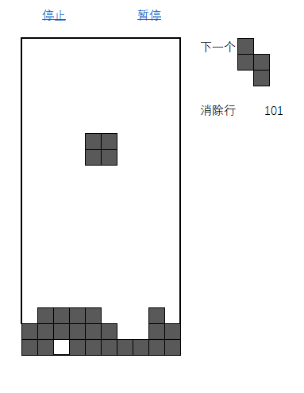

# Tetris
## Excel版的俄罗斯方块，需要用到VBA

追求尽可能不用VBA代码处理逻辑，仅用Excel的单元格公式运算。

## 操作
键盘<kbd>←</kbd><kbd>→</kbd>移动方块，<kbd>↑</kbd>旋转，<kbd>↓</kbd>速降。

## 演示

## 下载

[俄罗斯方块.xlsm](https://github.com/beanjeally/Tetris/raw/master/%E4%BF%84%E7%BD%97%E6%96%AF%E6%96%B9%E5%9D%97.xlsm)
